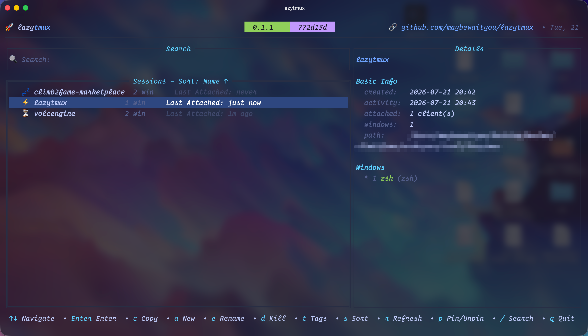
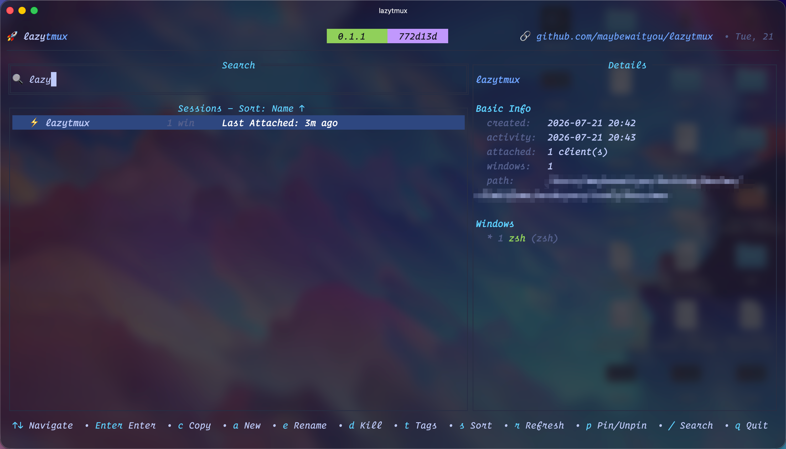
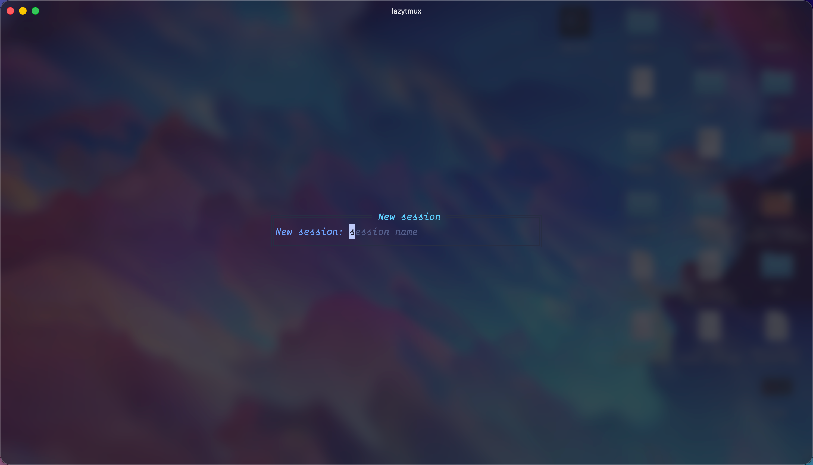
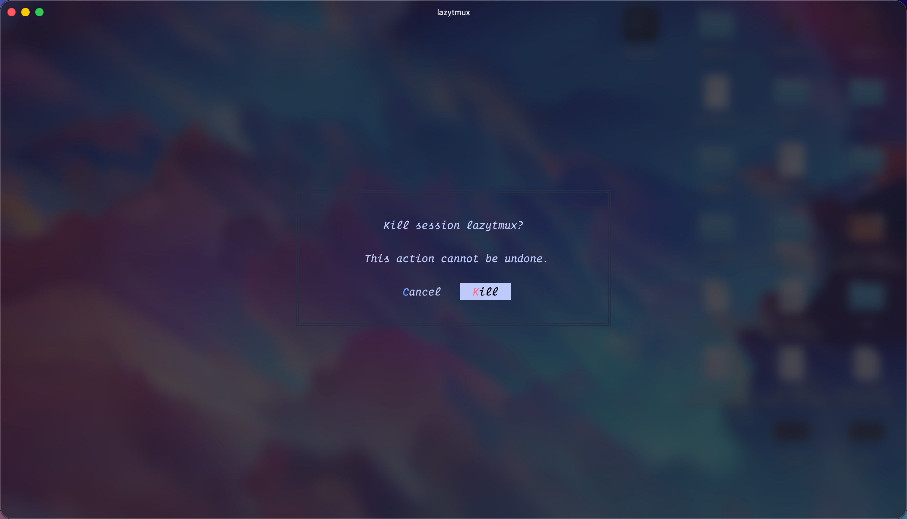
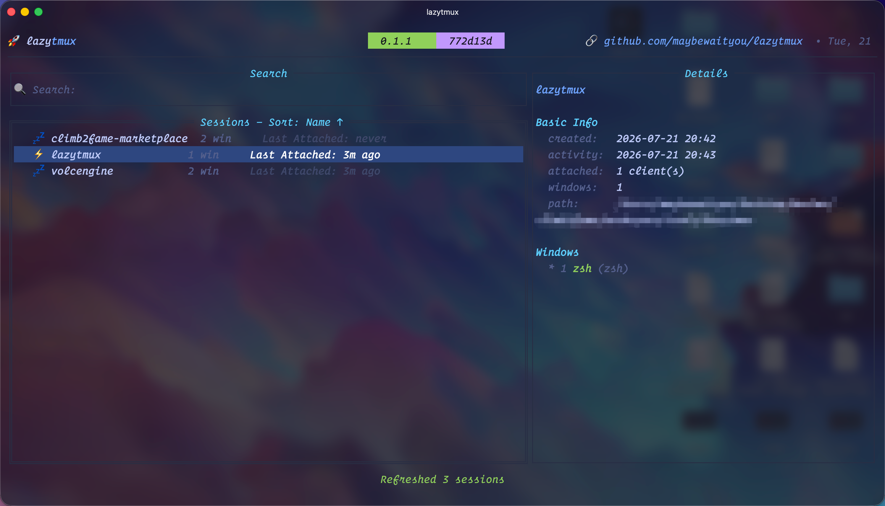

<div align="center">

# lazytmux

A terminal-based, interactive **tmux session manager** — inspired by [lazyssh](https://github.com/Adembc/lazyssh).

**[English](./README.md)** | [简体中文](./README.zh-CN.md)

</div>

---

lazytmux brings the lazyssh experience to your tmux server.
<br/>
With lazytmux, you can list, search, sort, pin, create, rename, kill, and enter your tmux sessions — all from a clean, keyboard-driven TUI. No more juggling `tmux ls` and `tmux attach -t <name>`; just a Tokyo Night–themed dashboard over your local tmux server.

---

## ✨ Features

### Session Management
- 📜 List sessions from the local tmux server with live status and window counts.
- ➕ Create new sessions from the UI.
- ✏️ Rename sessions in place.
- 🗑️ Kill sessions safely.
- 📌 Pin / unpin favorites to keep them at the top.

### Quick Navigation
- 🔍 Fuzzy search by session name.
- ⌨️ One‑keypress enter: `switch-client` inside tmux, `attach` outside (auto‑detected).
- ↕️ Sort by name / created / activity / last‑attached.

### Workflow
- 🧩 Details pane with a per-session window list.
- 📋 Copy `tmux attach -t <name>` to the clipboard.
- 🔄 Background refresh of session and window state.

---

## 🔒 How it works

lazytmux does not introduce any new risks. It is simply a TUI wrapper around your system's native `tmux` binary.

- All operations (list, create, rename, kill, attach) are executed through the `tmux` CLI — lazytmux never talks to the tmux server directly.

- Your `~/.tmux.conf` and existing sessions are never read or modified by lazytmux.

- The only thing lazytmux writes is its own state: pins and tags live in `~/.lazytmux/metadata.json`, and logs go to `~/.lazytmux/lazytmux.log`. Writes are atomic, so a crashed run never leaves a half-written metadata file.

---

## 📷 Screenshots

<div align="center">

### 📋 Session Dashboard


Main dashboard listing every local tmux session with live status and window counts, a per-session details pane, and pinned favorites kept at the top.

---

### 🔎 Fuzzy Search


Press `/`, type, and the list narrows to matching sessions in real time.

---

### ➕ Create Session


Press `a` to spin up a new tmux session straight from the UI.

---

### 🗑️ Kill Session


Press `d` to safely kill the selected session — the status bar confirms the result.

---

### 🔄 Background Refresh


Press `r` to pull fresh session and window state from tmux in the background while keeping your selection intact.

</div>

---

## 📦 Installation

### Option 1: Homebrew (macOS)

```bash
brew install maybewaityou/tap/lazytmux
```

`lazytmux` drives your system `tmux`, which Homebrew pulls in automatically via the `tmux` dependency.

> **Newer Homebrew (5.1.15+/6.0):** third-party taps are untrusted by default. If install fails with `Refusing to load formula ... from untrusted tap`, trust the tap first (one-time):
>
> ```bash
> brew trust maybewaityou/tap
> ```

### Option 2: Download Binary from Releases

Download a prebuilt binary from [GitHub Releases](https://github.com/maybewaityou/lazytmux/releases). The snippet below detects the latest version and fetches the right tarball for your OS/arch (darwin/linux × amd64/arm64):

```bash
# Detect latest version
LATEST_TAG=$(curl -fsSL https://api.github.com/repos/maybewaityou/lazytmux/releases/latest | jq -r .tag_name)

# Normalize OS/arch to the release asset name (darwin/linux × amd64/arm64)
OS=$(uname -s | tr '[:upper:]' '[:lower:]')
ARCH=$(uname -m)
case "$ARCH" in
  x86_64) ARCH=amd64 ;;
  aarch64|arm64) ARCH=arm64 ;;
esac

# Download + extract + install
curl -LJO "https://github.com/maybewaityou/lazytmux/releases/download/${LATEST_TAG}/lazytmux_${OS}_${ARCH}.tar.gz"
tar -xzf lazytmux_${OS}_${ARCH}.tar.gz
sudo mv lazytmux /usr/local/bin/

# enjoy!
lazytmux
```

### Option 3: Build from Source

```bash
# Clone the repository
git clone https://github.com/maybewaityou/lazytmux.git
cd lazytmux

# Build (runs fmt + go vet first)
make build
sudo mv bin/lazytmux /usr/local/bin/

# Or run it directly without installing
make run
```

### Snapshot binaries (optional)

`make build-all` produces cross-compiled snapshots via [goreleaser](https://goreleaser.com) (linux/darwin × amd64/arm64):

```bash
make build-all
```

---

## ⌨️ Key Bindings

| Key   | Action                                  |
| ----- | --------------------------------------- |
| `/`   | Focus search bar                        |
| `↑↓`  | Navigate sessions                |
| `Enter` | Enter session (`switch-client` / `attach`) |
| `a`   | New session                             |
| `e`   | Rename session                          |
| `d`   | Kill session                            |
| `p`   | Pin / unpin                             |
| `s`   | Cycle sort field                        |
| `S`   | Cycle sort field (skip one)             |
| `r`   | Refresh                                 |
| `c`   | Copy `tmux attach -t <name>`            |
| `Esc` | Blur search bar (keeps the query)       |
| `q`   | Quit                                    |

**In the session form:**

| Key     | Action   |
| ------- | -------- |
| `Enter` | Submit   |
| `Esc`   | Cancel   |

Tip: the status bar at the bottom shows the result of your last action.

---

## 🏗 Architecture

Hexagonal (ports & adapters):

```
cmd/main.go                       → cobra root, wires deps + tmux presence check
internal/core/domain/             → Session / Window models
internal/core/ports/              → SessionRepository / SessionService / MetadataStore
internal/core/services/           → business logic
internal/adapters/tmuxcli/        → tmux CLI adapter (parses list-sessions -F output)
internal/adapters/data/metadata   → ~/.lazytmux/metadata.json (pins/tags)
internal/adapters/ui/             → tview TUI (Tokyo Night)
internal/logger/                  → zap → ~/.lazytmux/lazytmux.log
```

---

## 🤝 Contributing

Contributions are welcome!

- If you spot a bug or have a feature request, please [open an issue](https://github.com/maybewaityou/lazytmux/issues).
- If you'd like to contribute, fork the repo and submit a pull request ❤️.

### Semantic commit messages

This project follows semantic commits. Please format your commit/PR title as:

- `type(scope): short descriptive subject`

Common types: `feat`, `fix`, `improve`, `refactor`, `docs`, `test`, `ci`, `chore`, `revert`.
Scope is optional (e.g. `ui`, `cli`, `core`).

Examples:
- `feat(ui): keep cursor when ESC blurs search bar`
- `fix(core): handle empty session list on startup`
- `docs: expand installation instructions`

---

## ⭐ Support

If you find lazytmux useful, please consider giving the repo a **star** ⭐️ and joining the [stargazers](https://github.com/maybewaityou/lazytmux/stargazers).

### ☕ Sponsor

If you'd like to support development:

<a href="https://www.buymeacoffee.com/maybewaityou" target="_blank"></a>

**WeChat Pay / Alipay**

<table>
  <tr>
    <td align="center">
      
      <br/>
      <b>WeChat Pay</b>
    </td>
    <td width="80"></td>
    <td align="center">
      
      <br/>
      <b>Alipay</b>
    </td>
  </tr>
</table>

---

## 🙏 Acknowledgments

- Built with [tview](https://github.com/rivo/tview) + [tcell](https://github.com/gdamore/tcell), [cobra](https://github.com/spf13/cobra), and [zap](https://go.uber.org/zap).
- Heavily inspired by [lazyssh](https://github.com/Adembc/lazyssh) — same architecture, same UX language, different target.
- Theme: Tokyo Night.
